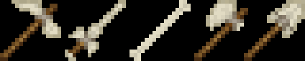
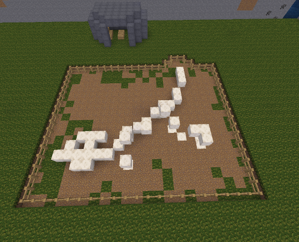
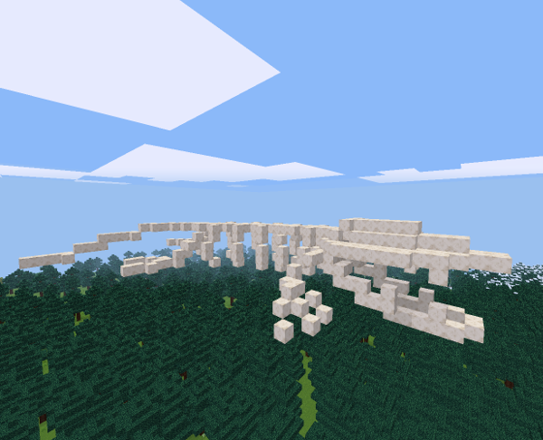

# Fossils
Minetest mod to add bones to the game.(WIP)

This Mod _Will_ Include: All bone tools, a bone block, ores underground(3-5 textures?)and schematics for large skeleton structures to spawn underground.

I'll be glad to consider any ideas or contributions!

## WIP

Ore and Schematic spawning,

More skeleton schematics [help wanted!](https://github.com/TekhnaeRaav/Fossils/issues/2)

## Tools

## Skeletons

### T Rex

### Leviathan

